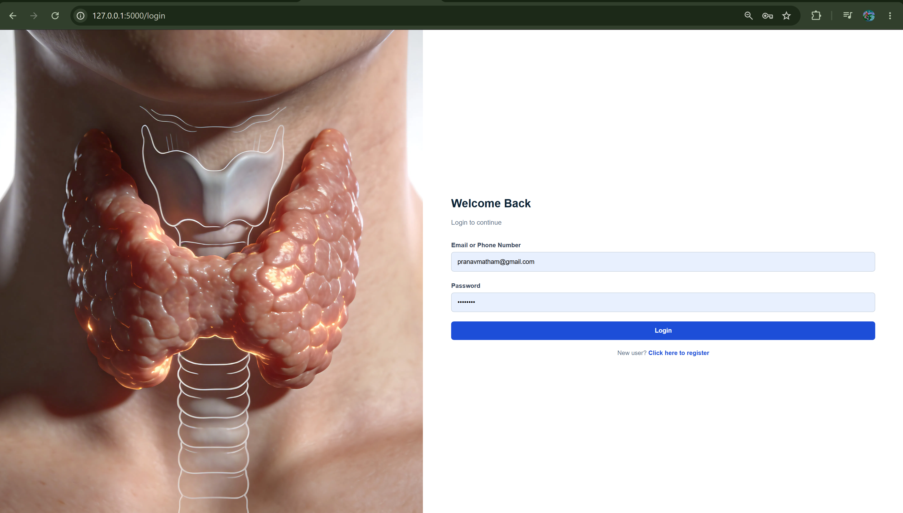
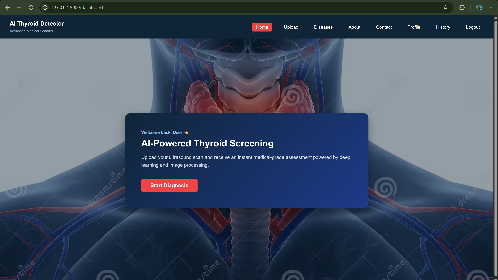
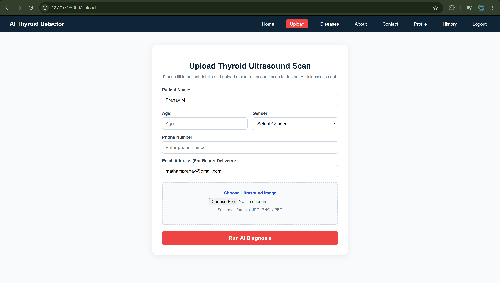
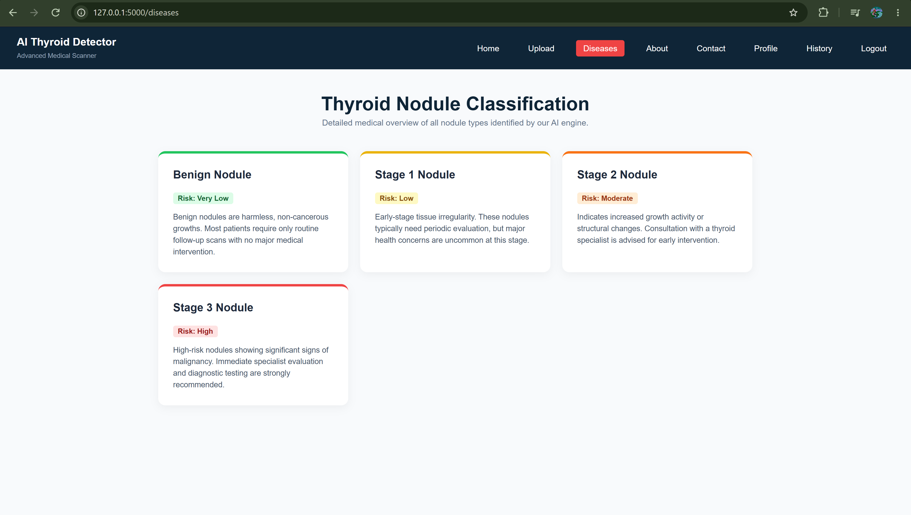
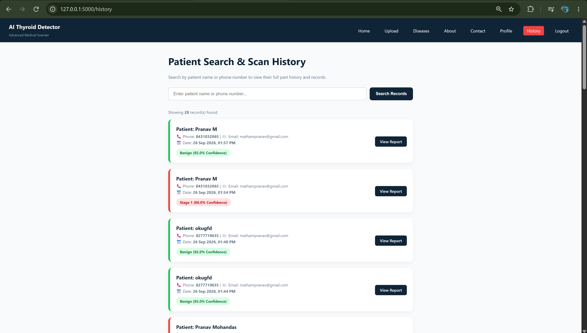
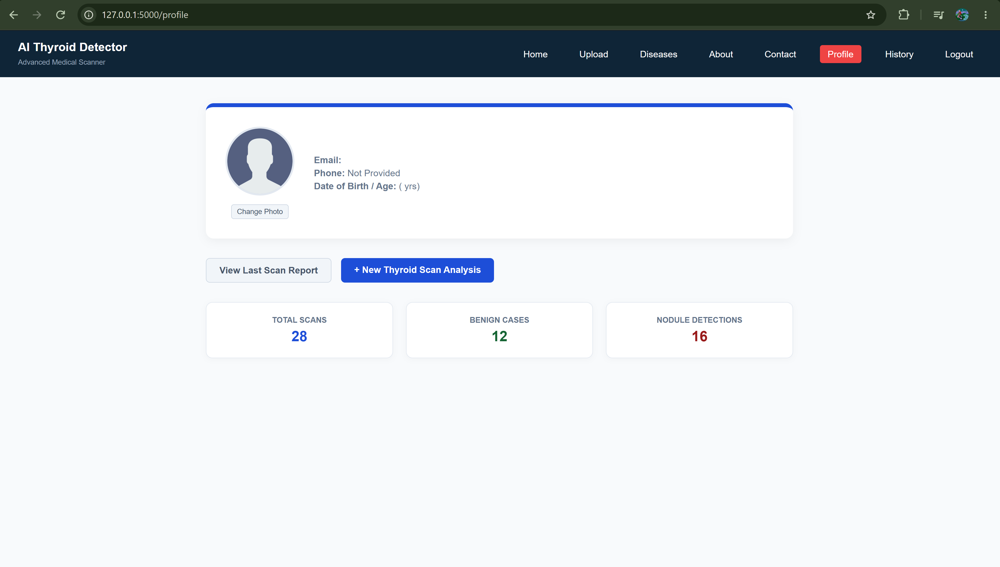
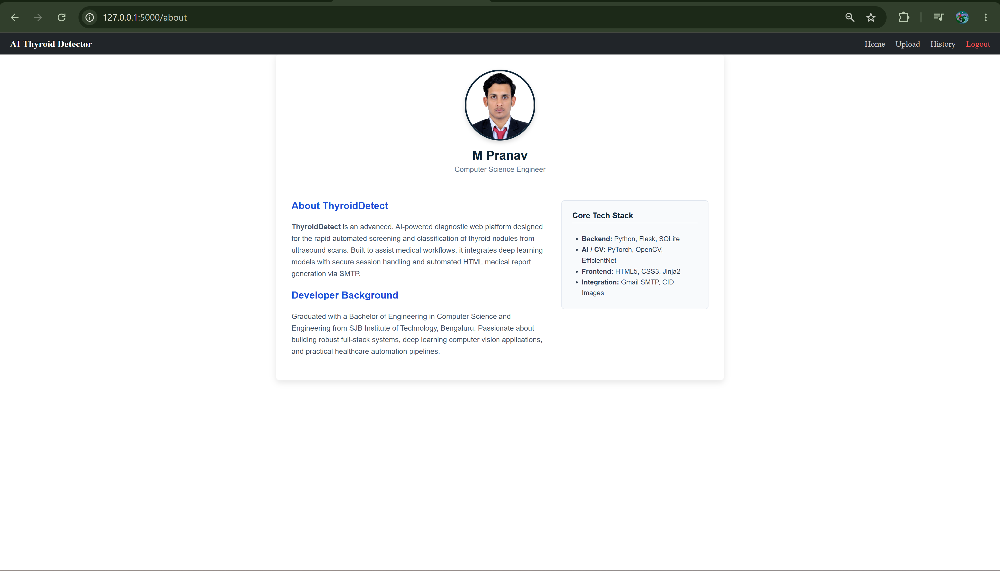

# 🩺 Thyroid Nodule Classification & Detection System

A CNN-based deep learning framework for automated thyroid nodule detection and classification using ultrasound images. The system combines **EfficientNet-B0, TensorFlow, Flask, Grad-CAM, and SQLite** to provide AI-assisted ultrasound image analysis, prediction confidence, explainable visualizations, and prediction history.

The project achieved approximately **95% classification accuracy** under the reported evaluation setup.

---

## 🎯 Project Overview

Thyroid nodules are commonly evaluated using ultrasound imaging, where accurate interpretation can assist in identifying potentially malignant cases.

This project implements an end-to-end AI-assisted workflow that allows a user to:

- Register and authenticate securely
- Upload a thyroid ultrasound image
- Preprocess the image for model inference
- Classify the uploaded image using a CNN
- Generate a prediction and confidence score
- Visualize model attention using Grad-CAM
- Store prediction results in SQLite
- Review previous predictions through prediction history

The system is designed as an **educational and research-oriented medical image classification application**.

---

## 📁 Project Structure

```text
Thyroid-Nodule-Classification/
│
├── app.py
├── requirements.txt
├── README.md
│
├── model/
│   └── EfficientNet-B0 trained model
│
├── data/
│   ├── train/
│   ├── validation/
│   └── test/
│
├── templates/
│   ├── login.html
│   ├── register.html
│   ├── home.html
│   ├── upload.html
│   ├── diseases.html
│   ├── history.html
│   ├── profile.html
│   └── about.html
│
├── static/
│   ├── css/
│   ├── js/
│   └── images/
│
├── db/
│   └── database.py
│
├── uploads/
│   └── Uploaded ultrasound images
│
├── login.png
├── home.png
├── upload.png
├── diseases.png
├── history.png
├── profile.png
└── about.png
---
```
## 🗄️ Core Components & Architecture

### `app.py` — Flask Backend

| Component | Description |
| :--- | :--- |
| **Flask Application** | Initializes and manages the web application |
| **Authentication** | Handles user registration, login, logout, and sessions |
| **Image Upload** | Accepts and validates thyroid ultrasound images |
| **Image Preprocessing** | Prepares uploaded images for CNN inference |
| **Model Inference** | Loads and executes the trained EfficientNet-B0 model |
| **Classification** | Generates the predicted thyroid nodule class |
| **Confidence Score** | Calculates prediction probability / confidence |
| **Grad-CAM** | Generates visual explanations for model predictions |
| **Prediction History** | Stores and retrieves previous prediction results |
| **Dashboard** | Provides access to the application's major features |

### `database.py` — Database Layer

| Component | Description |
| :--- | :--- |
| **SQLite Database** | Lightweight relational database for application data |
| **User Data** | Stores registered user information |
| **Prediction Data** | Stores classification results |
| **History Management** | Retrieves previous predictions |
| **Database Operations** | Provides backend access to stored application data |

---

## 🧠 Deep Learning Architecture

The classification engine uses **EfficientNet-B0**, a convolutional neural network architecture designed to provide strong image classification performance while maintaining computational efficiency.

| Stage | Implementation |
| :--- | :--- |
| **Input** | Thyroid ultrasound image |
| **Preprocessing** | Image resizing and normalization |
| **Feature Extraction** | EfficientNet-B0 convolutional layers |
| **Classification** | CNN-based thyroid nodule classification |
| **Prediction** | Benign / Malignant or configured classification stage |
| **Confidence** | Prediction probability |
| **Explainability** | Grad-CAM heatmap |
| **Output** | Classification result + confidence + visualization |

---

## 🔄 System Flow

```text
User
  ↓
Login / Register
  ↓
Authentication
  ↓
Dashboard / Home
  ↓
Upload Thyroid Ultrasound Image
  ↓
Image Validation & Preprocessing
  ↓
EfficientNet-B0 Model
  ↓
Thyroid Nodule Classification
  ↓
Prediction + Confidence Score
  ↓
Grad-CAM Visualization
  ↓
Store Result in SQLite
  ↓
Prediction History
  ↓
View Diagnosis Result

```
## 📸 App Interface Gallery

### 1. Authentication & Dashboard

| Login Page | Home / Dashboard |
| :---: | :---: |
|  |  |

### 2. Thyroid Scan & Information

| Upload Scan | Diseases Information |
| :---: | :---: |
|  |  |

### 3. History & Profile

| Patient History | User Profile |
| :---: | :---: |
|  |  |

### 4. About

| About Page |
| :---: |
|  |
🌐 Repository

GitHub Repository: PRANAV-MS25/thyroid-cancer-detection-Project

© 2026 Pranav Matham. All rights reserved.
